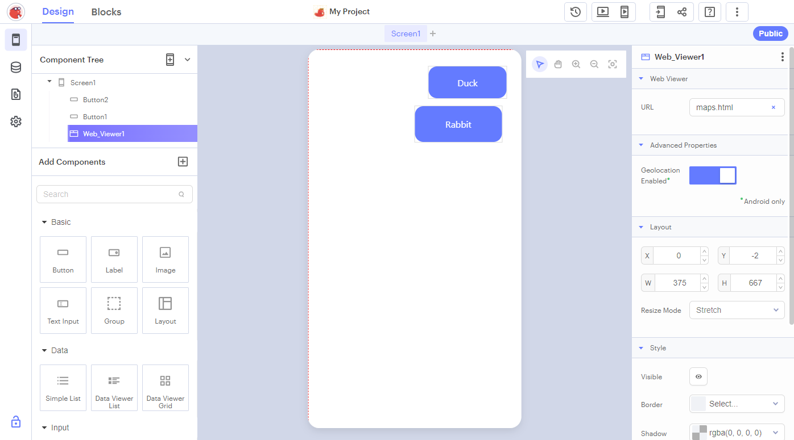
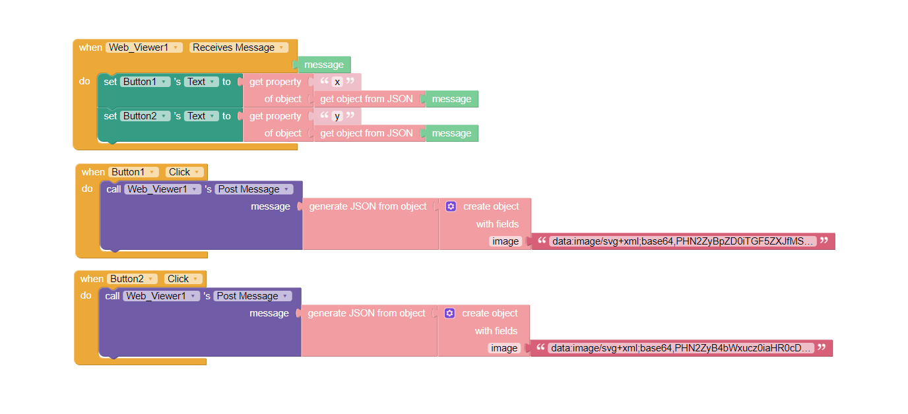

# Usage

Upload the index.html file to Thunkable.  
Create a web viewer and use `index.html` as the URL.  
Communication with the module can be done via "Post Message" and "Receive Message" using JSON.  

# Post Message

An object should be sent that may contain the following properties:
* `x` & `y`: Position to be centered on
* `zoom`: Absolute zoom value
* `zoomBy`: Zoom in/out, e.g., 1.1 for 10% zoom in
* `rotate`: Absolute rotation value
* `rotateBy`: Rotate, e.g., 10 for rotating 10° to the right
* `image`: Data URL of the image (e.g. data:image/svg+xml;base64,AbC...xYz )
	* URL can be generated using [https://ezgif.com/image-to-datauri]() (Include tags for: Nothing)
	* If no position is specified, it will be centered on the image's center.

Use `generate JSON from object` Node on the object before sending, otherwise it won't work on the phone

# Receive Message

When clicking on the image, an object is received with the properties:
* `type`: This always contains "click", for now
* `x` & `y`: Position on the image; can also be negative or larger than the image if clicking beside the image.
Use `get object from JSON` Node on the message, to extract the content, otherwise it won't work on the phone

# Example

Design:

Blocks:
